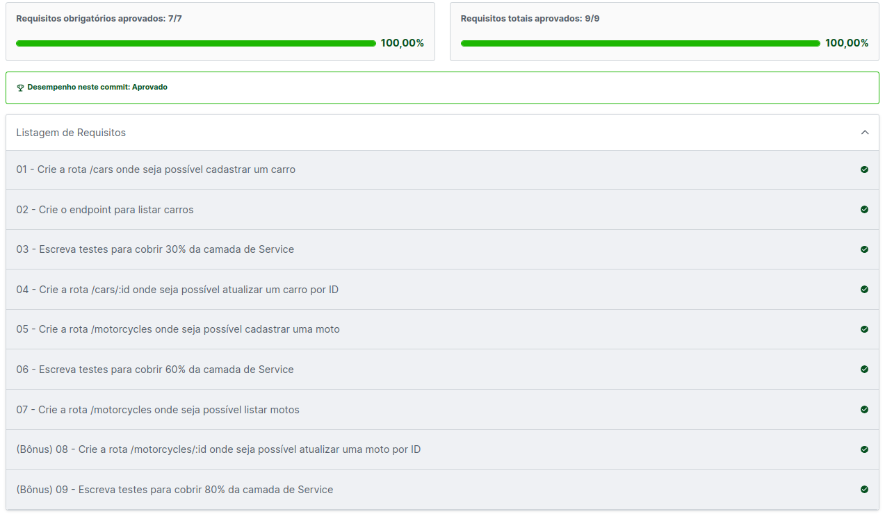

# CarShop
Projeto Carshop desenvolvido durante a formação do curso da Trybe. Aplicação do CRUD com Mongoose com Typescript. A finalidade era treinar o paradigma da Programação Orientada a Objetos e TDD.

## endpoints `/cars` e `/motorcycles`
Ao utilizá-lo com o método <strong>POST</strong>, o usuário pode adicionar um veículo no banco de dados, passando um body do tipo:
  <h3>Carros</h3>
```json
{
  "model": "Marea",
  "year": 2002,
  "color": "Black",
  "status": true,
  "buyValue": 15.990,
  "doorsQty": 4,
  "seatsQty": 5
}
```
  <h3>Motos</h3>
```json
{
  "model": "Honda Cb 600f Hornet",
  "year": 2005,
  "color": "Yellow",
  "status": true,
  "buyValue": 30.000,
  "category": "Street",
  "engineCapacity": 600
}
```
Listar todos os carros existentes com o método <strong>GET</strong> ou ainda listar veículos específicos pelo id (com o endpoint <storng>/<id></strong>)
O retorno será do tipo:
  <h3>Carros</h3>
```json
        [
          {
            "id": "634852326b35b59438fbea2f",
            "model": "Marea",
            "year": 2002,
            "color": "Black",
            "status": true,
            "buyValue": 15.99,
            "doorsQty": 4,
            "seatsQty": 5
          },
          {
            "id": "634852326b35b59438fbea31",
            "model": "Tempra",
            "year": 1995,
            "color": "Black",
            "buyValue": 39,
            "doorsQty": 2,
            "seatsQty": 5
          }
        ]
```
e
```json
        {
          "id": "634852326b35b59438fbea2f",
          "model": "Marea",
          "year": 2002,
          "color": "Black",
          "status": true,
          "buyValue": 15.99,
          "doorsQty": 4,
          "seatsQty": 5
        }
```
  <h3>Motos</h3>
```json
[
  {
    "id": "634852326b35b59438fbea2f",
    "model": "Honda Cb 600f Hornet",
    "year": 2005,
    "color": "Yellow",
    "status": true,
    "buyValue": 30.000,
    "category": "Street",
    "engineCapacity": 600
  },
  {
    "id": "634852326b35b59438fbea31",
    "model": "Honda Cbr 1000rr",
    "year": 2011,
    "color": "Orange",
    "status": true,
    "buyValue": 59.900,
    "category": "Street",
    "engineCapacity": 1000
  }
]
```
e
```json
{
  "id": "634852326b35b59438fbea31",
  "model": "Honda Cbr 1000rr",
  "year": 2011,
  "color": "Orange",
  "status": true,
  "buyValue": 59.900,
  "category": "Street",
  "engineCapacity": 1000
}
```

Para deleter um veículo, pode-se utilizar o método <strong>DELETE</strong>, passando o id por parâmetro. Nesse caso não há retorno, apenas o statusCode `204`.

<details>
  <summary><strong>Avaliação</strong></summary><br />

  

</details>

## 🛠️ tecnologias e frameworks utilizados
* [Node.js (Express)](http://expressjs.com/);
* [Typescript](https://www.typescriptlang.org/pt/docs/);
* [Mongoose](https://mongoosejs.com/);
* [dotenv](https://www.dotenv.org/docs);
* [MongoDB](https://www.mongodb.com/);

## ✒️ Autores
Nste projeto, tanto a aplicação, quanto os testes da mesma foram realizados por mim, [Patrick Gomes](https://www.linkedin.com/in/patrickgomesc/).

## 🎁 Honras

* Agradeço primeiramente a Deus;
* Agradeço à Instituição [Trybe](https://www.betrybe.com/) pelo estímulao diário a melhorar 🫂;
* Dediquei-me como sempre faço a este trabalho e espero que tenham gostado. A evolução é constante!
* Colossenses 3:23;
---
feito por [Patrick Gomes da Conceição](https://github.com/Patrickfromjesus);
